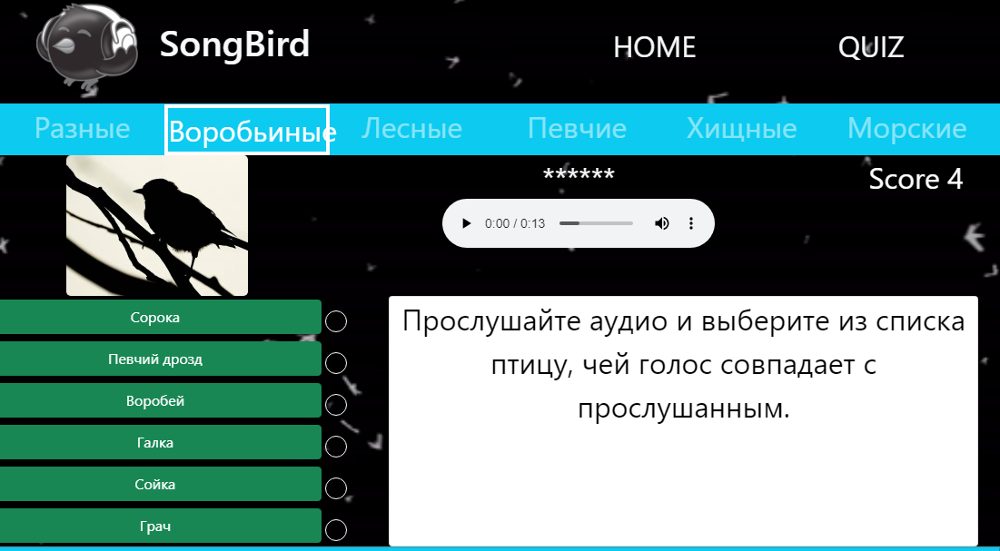
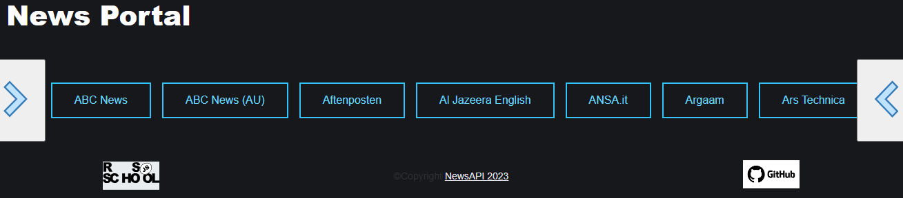
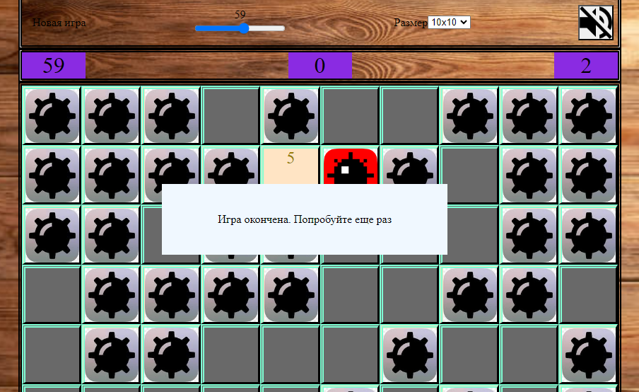

rsschool-cv

# ALEXANDER PANOV

## Junior Frontend Developer

### Contact Me

E-mail: apanov08@gmail.com\
Tel: 89372130416\
Discord: unoname

### About Me

I am a lawyer by training. I have experience in this field. I also worked as a household appliance repairman. In 2020, I took web development courses from the employment center. Since the course program was weak, I left programming for about a year. In 2021, I completed programming courses at Innopolis University. There I learned about RSShool. I really like programming and I think that RSSchool can help me master this profession. That's why I'm here (RSShool).

### Education

2021 - Сourses professional retraining "Innopolis University" (qualification Junior Frontend Developer)

### Skills

Basic

- HTML
- CSS
- JavaScript
- React
- Git
- English (A1)

### Code Example

Codewars Function composition

```
const compose = (...functions) => (a) => functions.reduceRight((acc,cur)=>cur(acc),a)
```

### Pet Projects
[](https://quiz-songbird.netlify.app/quiz)


[](https://rolling-scopes-school.github.io/unoname-JSFE2023Q1/migration-to-ts/)

[](https://649b21d52097310086b24393--effulgent-cajeta-47562a.netlify.app/)
#### Reference

[GitHub](https://github.com/unoname) [](https://www.codewars.com/users/Alexandr%20Panov) [freecodecamp](https://www.freecodecamp.org/fcc2dff6e20-041d-4e7b-8b42-092ad882af0b)
